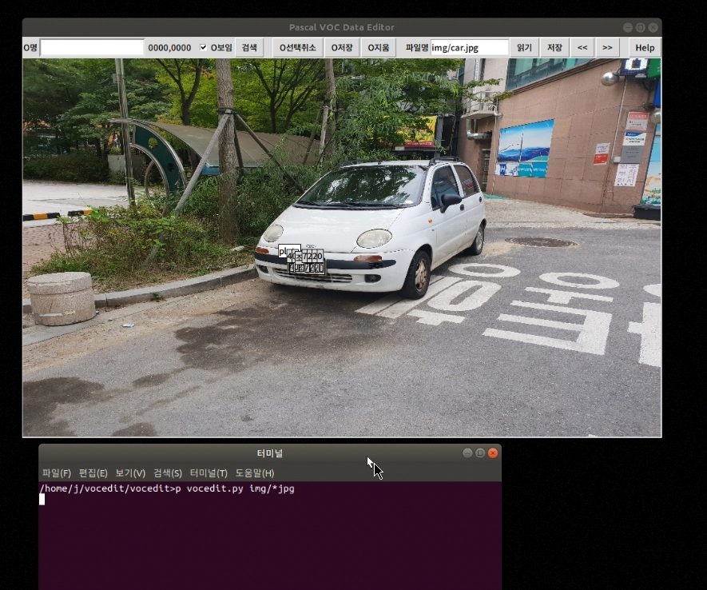

Simple VOC Pascal data editor 
============================ 
 
Simple VOC Pascal Data Editor 
 
We configured it as a concise Source as possible 
The program file can be composed of one and can be easily rewritten by the developer. 
 
After reading jpg, display object area and save. 
The xml file name is written as jpg name + '.xml'. 
 
 
 
# Start the program 
  python3 vocedit.py jpg_file list 
  python3 vocedit_eng.py jpg_file list # English Version 
  - Argument must have at least one jpg file. 
  ex) python3 vocedit.py *.jpg
 
# Create object 
 1. Select the object area by dragging 
 2. Edit the object name and save it. 
 
# Change object name 
 1. Double-click on multiple objects 
 2. Edit the object name and save it. 
 
# Create object part 
 1. Selecting Large Objects 
 2. Create an object by dragging the object contained in the big object 
 
# Object selection operation 
Select All: Ctl-A 
Deselect all: ESC 
Add selection: left mouse click 
Uncheck: Right mouse click 
Delete selected: Del 
Bean auto-analysis: Ctrl-P 
 
#file 
Read File: Ctl-R 
Save file: Ctl-U 
Previous file: PageUp 
Next file: PageDown 
